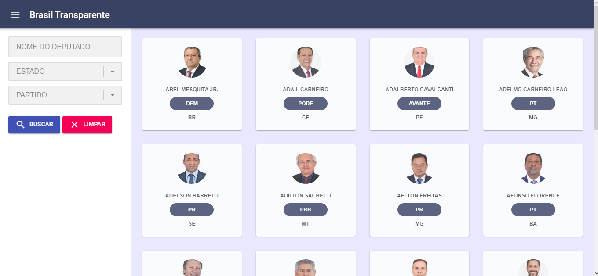
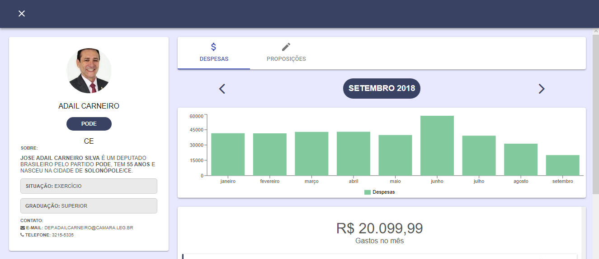
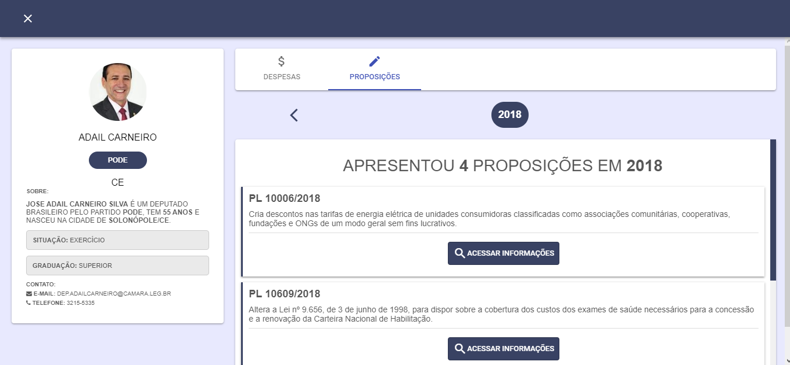
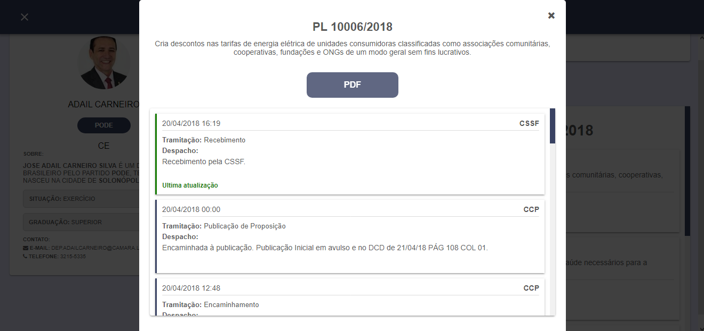

  <h3 align="center">Brasil Transparente</h3>

---

## Overview

Information about government spending and projects easily and quickly, extracted directly from the government api.

This project was developed for the Rocketseat GoReact course.

## Preview

## APIs

- [Dados Abertos](https://dadosabertos.camara.leg.br/)

## Running the project

- Clone this repository
- Install all dependencies using the command `yarn`
- Run `yarn start`
- Access http://localhost:3000/

## Used technologies

- React
- React Router DOM
- Redux
- Redux Sagas
- Axios
- Recharts
- Material -UI
- Other React JS libs
